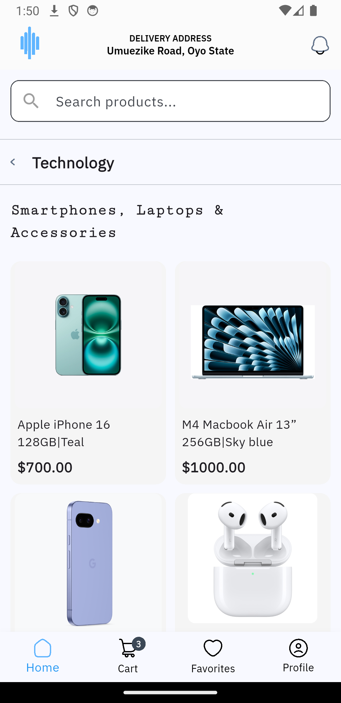
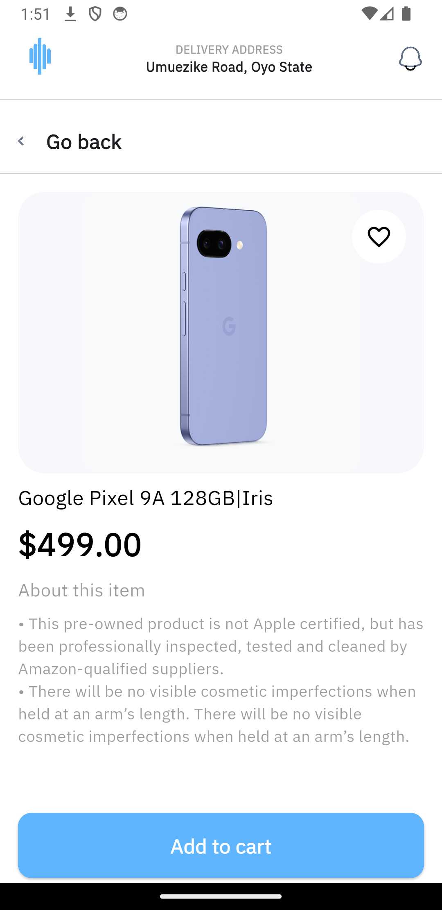
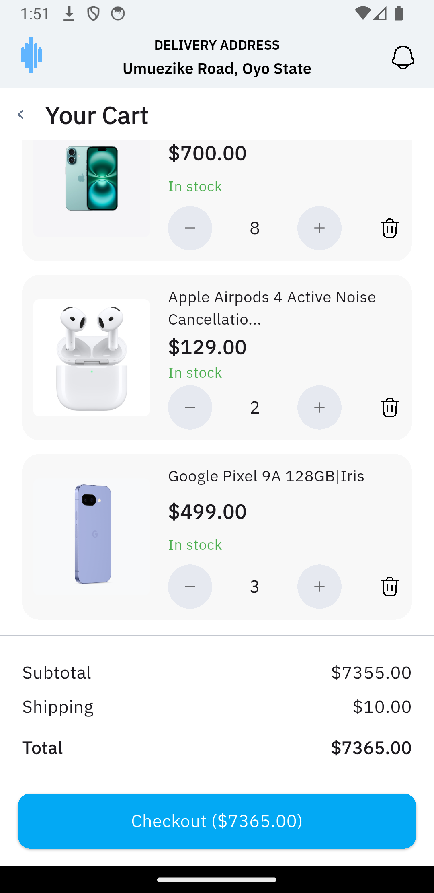

# AlphaTwelve E-Commerce App

A modern e-commerce application built with Flutter, featuring a clean UI and smooth user experience for browsing and purchasing products.

## 🚀 Features

- Product catalog with categories
- Product details view
- Shopping cart functionality
- Responsive design for various screen sizes
- Modern UI with smooth animations

## 🛠 Tech Stack

- **Framework**: Flutter (Dart)
- **State Management**: Provider
- **Navigation**: Go Router
- **UI Components**: Material Design & Cupertino
- **HTTP Client**: Built-in http package
- **Local Storage**: Shared Preferences
- **Fonts**: Google Fonts
- **Icons**: Material Icons & Custom SVG Icons
- **Responsive Layout**: flutter_screenutil

## 📱 Screenshots

<div style="display: flex; flex-wrap: wrap; gap: 10px;">
  
  
  
</div>

## 🚀 Getting Started

### Prerequisites

- Flutter SDK (latest stable version)
- Android Studio / Xcode (for emulator/simulator)
- VS Code or Android Studio with Flutter plugins

### Installation

1. **Clone the repository**
   ```bash
   git clone https://github.com/yourusername/alphatwelve.git
   cd alphatwelve
   ```

2. **Install dependencies**
   ```bash
   flutter pub get
   ```

3. **Run the app**
   ```bash
   flutter run
   ```

   Or open the project in VS Code/Android Studio and press F5 to start debugging.

### Building for Production

#### Android
```bash
flutter build apk --release
```

#### iOS
```bash
flutter build ios --release
```

## 🏗 Project Structure

```
lib/
├── models/         # Data models
├── views/          # UI screens
├── widgets/        # Reusable widgets
├── providers/      # State management
├── services/       # Business logic
├── utils/          # Helper functions
└── main.dart       # App entry point
```

## 🤝 Contributing

Contributions are welcome! Please feel free to submit a Pull Request.

## 📄 License

This project is licensed under the MIT License - see the [LICENSE](LICENSE) file for details.

---

Made with ❤️ using Flutter
